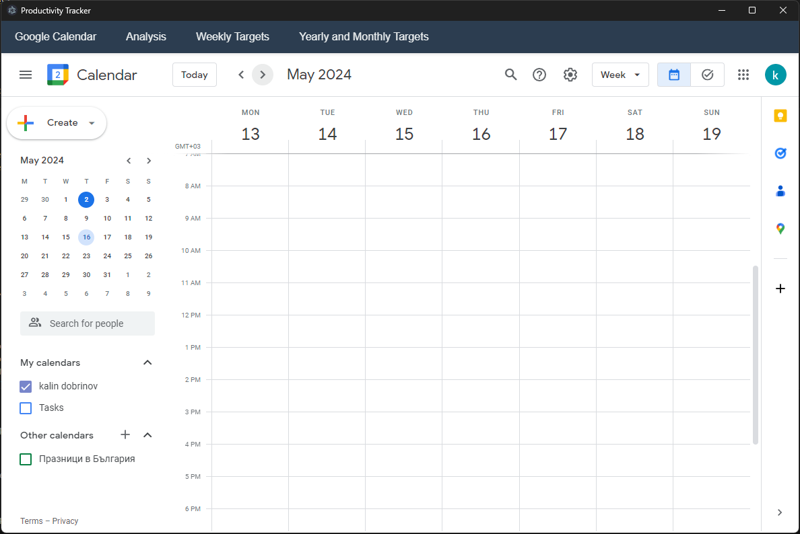
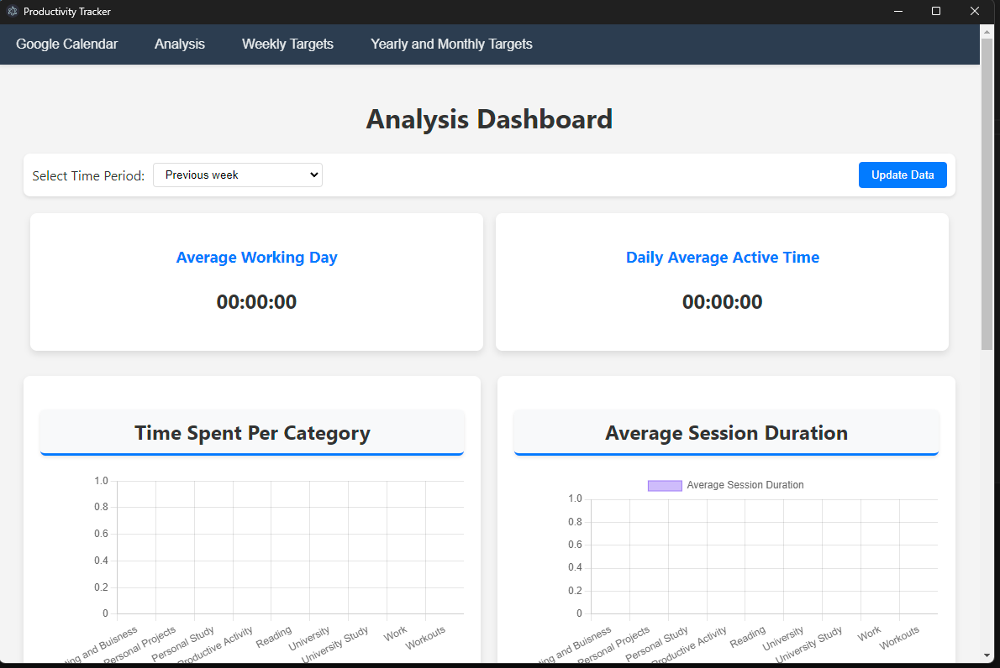
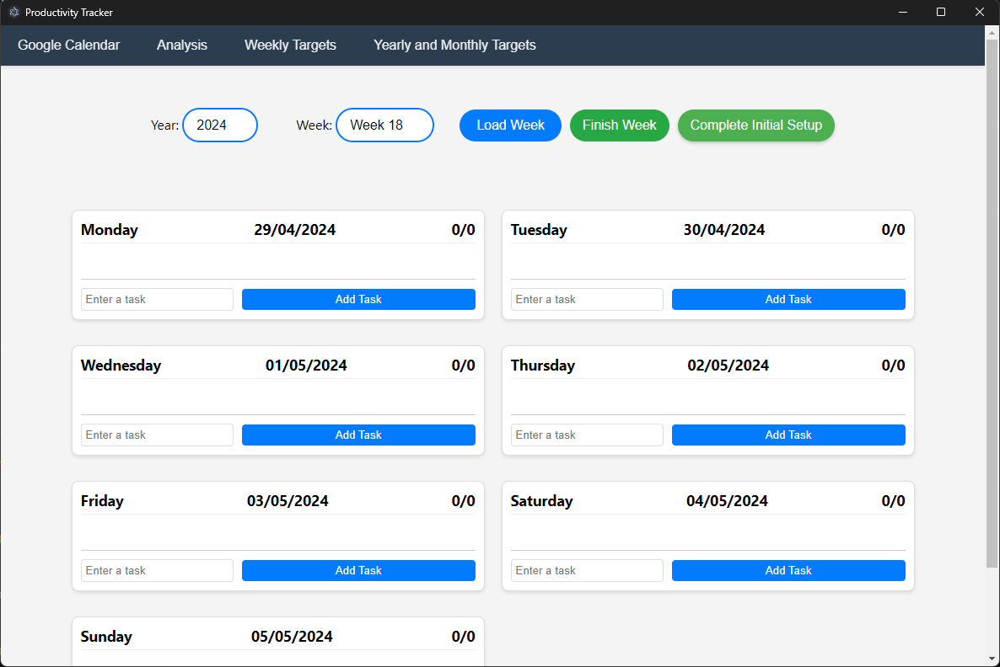
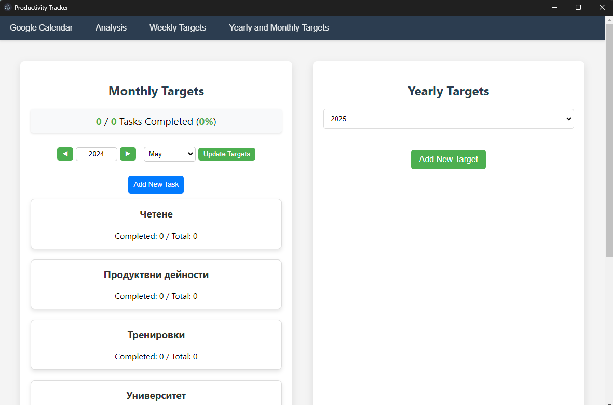

# Productivity Tracker

Productivity Tracker is an innovative desktop application designed to help individuals optimize their time management and productivity. Built using Express.js and integrating Google Calendar, this application allows users to track their activities, analyze productivity data, and set daily, weekly, monthly, and yearly goals.

## Features

- **Google Calendar Integration**: Seamlessly connect with Google Calendar to track and log your activities directly through the application.
- **Productivity Analysis**: Utilize advanced analytics to understand your time usage better with metrics like average working time, daily active time, time spent per category, average session duration, number of sessions, and event summaries.
- **Customizable Analysis Periods**: Choose specific periods for analysis, including the previous week, current week, previous 30 days, a specific month, or custom date ranges.
- **Weekly Targets**: Set and track daily tasks for each week, enhancing focus and efficiency.
- **Long-term Goal Setting**: Plan and monitor monthly and yearly targets across various categories to stay aligned with your long-term objectives.

## Getting Started

### Prerequisites

Ensure you have the following installed:
- Node.js
- Python 3.8 or higher
- npm (Node package manager)

### Installation

1. Clone the repository:
   ```bash
   git clone https://github.com/KalinBorodzhijski/Productivity-Tracker.git
    ```

2. Navigate to the project directory:
   ```bash
    cd Productivity-Tracker
    ```

3. Install the required npm packages:
   ```bash
    npm install
    ```

4. Install Python dependencies:
   ```bash
    pip install -r requirements.txt
    ```

### Configuration

1. Set up Google Calendar API credentials according to the Google Developers Console.
2. Place your credentials.json file in the root of the project directory.
3. Configure environment variables as needed in a .env file in the root directory.

### Running the Application

Start the application by running:
```bash
npm start
```

This will launch the Express server and open the application window.


## Usage
- Tracking Time: Navigate to the Google Calendar tab to view and manage your calendar events.


- Analyzing Productivity: Switch to the Analysis tab to view detailed analytics about your time usage.


- Setting Weekly Targets: Use the Weekly Targets tab to specify and check off tasks for each day of the current week.


- Managing Long-Term Goals: In the Yearly/Monthly Targets tab, set specific objectives you wish to achieve over longer periods.
